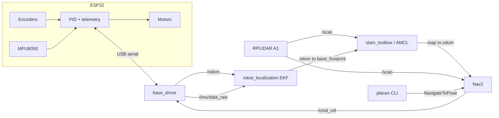

# casabot

A differential-drive robot that maps a house with a 2D lidar, then drives to
places you name.

```bash
ros2 run casabot places save kitchen
ros2 run casabot places go kitchen
```

Everything runs in Gazebo with no hardware, so you can try it before buying a
single part. The same launch files then run on the real robot with one argument
changed.

- **ROS 2 Jazzy** · **Gazebo Harmonic** · Raspberry Pi 5 + ESP32
- Mapping: [`slam_toolbox`](https://github.com/SteveMacenski/slam_toolbox) (async, with loop closure)
- Navigation: [Nav2](https://docs.nav2.org/) with Regulated Pure Pursuit
- Sensor fusion: [`robot_localization`](http://docs.ros.org/en/jazzy/p/robot_localization/) EKF over wheel odometry + IMU

## How it fits together



Only two pieces here are mine: `base_driver` (a serial bridge, ~170 lines) and
`places` (named waypoints, ~140 lines). Everything else is off-the-shelf ROS 2,
configured rather than rewritten. That is the point — the interesting work in a
robot like this is the URDF, the frames, the parameters and the calibration, not
a hand-rolled SLAM implementation that will be worse than `slam_toolbox`.

## Why lidar, and not a camera

Three options were on the table: 2D lidar, RGB-D visual SLAM, or monocular.

Lidar won on **failure modes**. Visual SLAM loses tracking against a blank
hallway wall, which is most of a house at 2 am with the lights off. A 360° lidar
does not care about texture or lighting, and at ~$100 it is cheaper than a
RealSense. The IMU is there because wheel odometry alone drifts in yaw on rugs,
and yaw drift is what bends a map.

The cost is that the robot knows nothing about *what* it sees. Adding a camera
for object-level goals ("go to the chair") is on the roadmap, not in the way.

## Quick start (simulation, no hardware)

On WSL2 or plain Linux, everything runs in a container — WSLg already provides
the GUI, so Gazebo and RViz just work.

```bash
git clone https://github.com/AdrianMelendez/casabot.git
cd casabot/docker
docker compose run --rm dev
```

The container builds a user with UID 1000, which is the default on WSL2 and on
most desktop installs. If `id -u` gives you something else, export it first so
files in the mounted workspace stay yours:

```bash
HOST_UID=$(id -u) HOST_GID=$(id -g) docker compose build
```

Then inside the container:

```bash
colcon build --symlink-install && source install/setup.bash
```

**Terminal 1** — robot in the apartment world:

```bash
ros2 launch casabot sim.launch.py
```

**Terminal 2** — mapping:

```bash
ros2 launch casabot mapping.launch.py use_sim_time:=true
```

**Terminal 3** — drive it around until the map looks complete, then save:

```bash
ros2 run teleop_twist_keyboard teleop_twist_keyboard
ros2 run nav2_map_server map_saver_cli -f ~/.casabot/map
```

Now restart with navigation instead of mapping, set the initial pose in RViz
with **2D Pose Estimate**, and name some places:

```bash
ros2 launch casabot navigation.launch.py use_sim_time:=true    # terminal 2
ros2 run casabot places save sofa                              # terminal 3
ros2 run casabot places go sofa
```

Extra shells into a running container: `docker compose exec dev bash`.

## Running on the real robot

Flash `firmware/esp32_base/esp32_base.ino` with the Arduino IDE (ESP32 core 3.x),
wire it per [`docs/hardware.md`](docs/hardware.md), then on the Pi:

```bash
ros2 launch casabot robot.launch.py \
    lidar_port:=/dev/casabot_lidar base_port:=/dev/casabot_base
```

Mapping and navigation are the same commands, minus `use_sim_time`:

```bash
ros2 launch casabot mapping.launch.py
ros2 launch casabot navigation.launch.py
```

Run the heavy GUI on your laptop instead of the Pi by setting the same
`ROS_DOMAIN_ID` on both machines and passing `rviz:=false` on the Pi.

**Calibrate before your first real map.** Encoder ticks per revolution, wheel
radius and wheel separation are measured on the built robot, not taken from the
datasheet. The procedure is in [`docs/hardware.md`](docs/hardware.md#calibration);
skipping it gives you a map that is subtly the wrong size.

## Named places

Poses are stored as `x`, `y`, `yaw` in the **map** frame, in
`~/.casabot/places.yaml`:

```yaml
kitchen: {x: 2.41, y: -1.08, yaw: 1.57}
sofa:    {x: -2.90, y: 1.55, yaw: 3.09}
```

```bash
ros2 run casabot places save <name>     # remember where the robot is right now
ros2 run casabot places list
ros2 run casabot places go <name>
ros2 run casabot places remove <name>
```

Places are tied to the map they were recorded against. Remap the house and you
re-record them — the map frame origin moves.

## Layout

```
casabot/
├── casabot/
│   ├── base_driver.py     serial bridge: cmd_vel -> wheels, encoders+IMU -> ROS
│   ├── kinematics.py      pure diff-drive maths, no ROS imports
│   └── places.py          save / list / go / remove named poses
├── config/
│   ├── ekf.yaml           robot_localization: odom + IMU -> odom->base_footprint
│   ├── slam.yaml          slam_toolbox async mapping
│   └── nav2.yaml          Nav2, trimmed to the params that matter
├── launch/
│   ├── robot.launch.py    real hardware: URDF, lidar, base driver, EKF
│   ├── sim.launch.py      the same robot in Gazebo Harmonic
│   ├── mapping.launch.py  slam_toolbox + RViz
│   └── navigation.launch.py  AMCL + Nav2 + RViz
├── urdf/                  casabot.urdf.xacro, gazebo.xacro (sim-only additions)
├── worlds/house.sdf       two-room apartment, big enough to need loop closure
├── firmware/esp32_base/   Arduino sketch: PID, encoders, MPU6050
├── docker/                ROS 2 Jazzy + Gazebo dev container (WSL2-friendly)
├── docs/hardware.md       BOM, wiring, serial protocol, calibration
└── test/test_kinematics.py
```

## Tests

The odometry maths is pure Python, so it runs anywhere, with no ROS installed:

```bash
python3 test/test_kinematics.py
```

If those pass and the robot still drifts, the fault is in the measured
constants, not the code — go back to calibration.

## Design notes

**Why an ESP32 instead of driving the motors from the Pi.** Linux is not
real-time. Counting quadrature edges at a few kHz and closing a velocity loop at
200 Hz is exactly the work a microcontroller is for, and moving it off the Pi
means a busy Nav2 cannot make the robot twitch.

**Why no `ros2_control`.** For two wheels and one serial link, a
`diff_drive_controller` setup costs a C++ hardware interface, a controller
config and a spawner launch to replace ~40 lines of Python. It earns its place
when there is a second actuator — an arm, a lift, a pan-tilt head — and not
before.

**Why the EKF runs in simulation too.** Gazebo's `DiffDrive` plugin will happily
publish `odom -> base_footprint` itself, but then sim and hardware take
different code paths, and the path you never exercise is the one that breaks.
The plugin's TF is deliberately not bridged.

**Why the Nav2 config is short.** `config/nav2.yaml` only sets the parameters
that differ from the Nav2 defaults. A 400-line copy of upstream is something you
have to re-diff on every release for no benefit.

## Roadmap

- [ ] Docking station and autonomous recharge
- [ ] `places go` from a phone (a small web UI over rosbridge)
- [ ] Camera + object detection for goals like "go to the chair"
- [ ] Multi-floor maps
- [ ] Persist the slam_toolbox pose graph so the map can be extended, not just replaced

## License

MIT — see [LICENSE](LICENSE).
