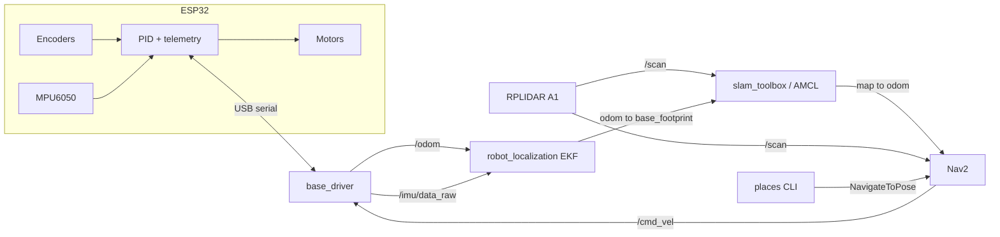

# casabot

A differential-drive robot that maps a house with a 2D lidar, then drives to
places you name.

```bash
ros2 run casabot places save kitchen
ros2 run casabot places go kitchen
```

Everything runs in Gazebo with no hardware, so you can try it before buying a
single part. The same launch files then run on the real robot with one argument
changed.

- **ROS 2 Jazzy** · **Gazebo Harmonic** · Raspberry Pi 5 + ESP32
- Mapping: [`slam_toolbox`](https://github.com/SteveMacenski/slam_toolbox) (async, with loop closure)
- Navigation: [Nav2](https://docs.nav2.org/) with Regulated Pure Pursuit
- Sensor fusion: [`robot_localization`](http://docs.ros.org/en/jazzy/p/robot_localization/) EKF over wheel odometry + IMU

## How it fits together


```mermaid
flowchart LR
    subgraph ESP32
        ENC[Encoders] --> FW[PID + telemetry]
        IMU[MPU6050] --> FW
        FW --> MOT[Motors]
    end

    FW <-->|USB serial| BD[base_driver]
    LIDAR[RPLIDAR A1] -->|/scan| SLAM

    BD -->|/odom| EKF[robot_localization EKF]
    BD -->|/imu/data_raw| EKF
    EKF -->|odom to base_footprint| SLAM[slam_toolbox / AMCL]
    SLAM -->|map to odom| NAV[Nav2]
    LIDAR -->|/scan| NAV
    NAV -->|/cmd_vel| BD

    PLACES[places CLI] -->|NavigateToPose| NAV
```

Only two pieces here are mine: `base_driver` (a serial bridge, ~170 lines) and
`places` (named waypoints, ~140 lines). Everything else is off-the-shelf ROS 2,
configured rather than rewritten. That is the point — the interesting work in a
robot like this is the URDF, the frames, the parameters and the calibration, not
a hand-rolled SLAM implementation that will be worse than `slam_toolbox`.

## Why lidar, and not a camera

Three options were on the table: 2D lidar, RGB-D visual SLAM, or monocular.

Lidar won on **failure modes**. Visual SLAM loses tracking against a blank
hallway wall, which is most of a house at 2 am with the lights off. A 360° lidar
does not care about texture or lighting, and at ~$100 it is cheaper than a
RealSense. The IMU is there because wheel odometry alone drifts in yaw on rugs,
and yaw drift is what bends a map.

The cost is that the robot knows nothing about *what* it sees. Adding a camera
for object-level goals ("go to the chair") is on the roadmap, not in the way.

## Quick start (simulation, no hardware)

On WSL2 or plain Linux, everything runs in a container — WSLg already provides
the GUI, so Gazebo and RViz just work.

```bash
git clone https://github.com/AdrianMelendez/casabot.git
cd casabot/docker
docker compose run --rm dev
```

On WSL2, add the GPU override so Gazebo renders on your graphics card instead
of the CPU (see [The simulation is slow](#the-simulation-is-slow)):

```bash
docker compose -f compose.yaml -f compose.wsl-gpu.yaml run --rm dev
```

The container builds a user with UID 1000, which is the default on WSL2 and on
most desktop installs. If `id -u` gives you something else, export it first so
files in the mounted workspace stay yours:

```bash
HOST_UID=$(id -u) HOST_GID=$(id -g) docker compose build
```

Then inside the container:

```bash
colcon build --symlink-install && source install/setup.bash
```

**Terminal 1** — robot in the apartment world:

```bash
ros2 launch casabot sim.launch.py
```

Add `headless:=true` to skip the Gazebo window. RViz shows everything you need
for mapping, and the Gazebo GUI is the single most expensive thing in the stack.

**Terminal 2** — mapping:

```bash
ros2 launch casabot mapping.launch.py use_sim_time:=true
```

**Terminal 3** — drive it around until the map looks complete, then save:

```bash
ros2 run teleop_twist_keyboard teleop_twist_keyboard --ros-args -p speed:=0.2 -p turn:=0.6
ros2 run nav2_map_server map_saver_cli -f ~/.casabot/map
```

teleop's defaults are 0.5 m/s and 1.0 rad/s, about twice what Nav2 will ever
drive this robot at. Drive slowly, go through every doorway, and finish where
you started so loop closure has something to close.

If `map_saver_cli` prints `Failed to spin map subscription` and writes nothing,
run it again. It happens intermittently, even with the robot stopped: 2 of 3
attempts failed in one test run and 0 of 6 in the next. A longer
`save_map_timeout` made no measurable difference.

### Navigating the saved map

Stop the mapping launch (Ctrl-C) and start navigation in its place. SLAM and
AMCL both publish `map -> odom`, so running both makes them fight.

```bash
ros2 launch casabot navigation.launch.py use_sim_time:=true    # terminal 2
```

RViz opens with the saved map, but the robot will not move yet: it has the
map, not its own position on it.

1. **Tell it where it is.** Click **2D Pose Estimate** in the RViz toolbar,
   click where the robot is on the map, and drag in the direction it faces.
   If the sim was restarted after mapping, the robot is back at the spawn
   point, which is the map origin, facing along the red axis.
2. **Check it.** The laser points should sit on the map's walls. If they are
   offset or rotated, set the pose again.
3. **Send it somewhere.** Click **Nav2 Goal**, click a spot on the map and drag
   the heading you want. The robot plans a path and drives there on its own.

If a Nav2 Goal does nothing, step 1 is almost always the reason.

### Naming places

Open another shell into the running container:

```bash
docker compose exec dev bash
```

Send the robot somewhere with **Nav2 Goal**, save the spot, and from then on
send it there by name:

```bash
ros2 run casabot places save kitchen --ros-args -p use_sim_time:=true
ros2 run casabot places go kitchen --ros-args -p use_sim_time:=true
```

Drop `--ros-args -p use_sim_time:=true` on the real robot; it is only for the
simulator's clock.

## Running on the real robot

Flash `firmware/esp32_base/esp32_base.ino` with the Arduino IDE (ESP32 core 3.x),
wire it per [`docs/hardware.md`](docs/hardware.md), then on the Pi:

```bash
ros2 launch casabot robot.launch.py \
    lidar_port:=/dev/casabot_lidar base_port:=/dev/casabot_base
```

Mapping and navigation are the same commands, minus `use_sim_time`:

```bash
ros2 launch casabot mapping.launch.py
ros2 launch casabot navigation.launch.py
```

Run the heavy GUI on your laptop instead of the Pi by setting the same
`ROS_DOMAIN_ID` on both machines and passing `rviz:=false` on the Pi.

**Calibrate before your first real map.** Encoder ticks per revolution, wheel
radius and wheel separation are measured on the built robot, not taken from the
datasheet. The procedure is in [`docs/hardware.md`](docs/hardware.md#calibration);
skipping it gives you a map that is subtly the wrong size.

## Named places

Poses are stored as `x`, `y`, `yaw` in the **map** frame, in
`~/.casabot/places.yaml`:

```yaml
kitchen: {x: 2.41, y: -1.08, yaw: 1.57}
sofa:    {x: -2.90, y: 1.55, yaw: 3.09}
```

```bash
ros2 run casabot places save <name>     # remember where the robot is right now
ros2 run casabot places list
ros2 run casabot places go <name>
ros2 run casabot places remove <name>
```

Places are tied to the map they were recorded against. Remap the house and you
re-record them — the map frame origin moves.

## Layout

```
casabot/
├── casabot/
│   ├── base_driver.py     serial bridge: cmd_vel -> wheels, encoders+IMU -> ROS
│   ├── kinematics.py      pure diff-drive maths, no ROS imports
│   └── places.py          save / list / go / remove named poses
├── config/
│   ├── ekf.yaml           robot_localization: odom + IMU -> odom->base_footprint
│   ├── slam.yaml          slam_toolbox async mapping
│   └── nav2.yaml          Nav2, upstream params plus this robot's overrides
├── launch/
│   ├── robot.launch.py    real hardware: URDF, lidar, base driver, EKF
│   ├── sim.launch.py      the same robot in Gazebo Harmonic
│   ├── mapping.launch.py  slam_toolbox + RViz
│   └── navigation.launch.py  AMCL + Nav2 + RViz
├── urdf/                  casabot.urdf.xacro, gazebo.xacro (sim-only additions)
├── worlds/house.sdf       two-room apartment, big enough to need loop closure
├── firmware/esp32_base/   Arduino sketch: PID, encoders, MPU6050
├── docker/                ROS 2 Jazzy + Gazebo dev container (WSL2-friendly)
├── docs/hardware.md       BOM, wiring, serial protocol, calibration
└── test/test_kinematics.py
```

## Tests

The odometry maths is pure Python, so it runs anywhere, with no ROS installed:

```bash
python3 test/test_kinematics.py
```

If those pass and the robot still drifts, the fault is in the measured
constants, not the code — go back to calibration.

### What has actually been run

The whole stack has been exercised headless in Gazebo Harmonic, in the
container in this repo:

- `colcon build`, both entry points registered, all four launch files parse
- `/scan` returns real ranges, `/cmd_vel` moves the robot, the EKF publishes
  `/odometry/filtered` and `odom -> base_footprint`
- slam_toolbox builds a map and publishes `map -> odom`; `map_saver_cli`
  writes it
- Nav2 brings up all ten lifecycle nodes with no errors and AMCL localises
- `places save`, `places list`, then `places go` after driving away, ending in
  `arrived at 'home'` within the goal tolerance
- A scripted 23-waypoint tour of both rooms, scored against the true geometry
  in `worlds/house.sdf`: map 8.1 x 6.1 m against 8.1 x 6.1 m of real wall,
  **100% of occupied cells within 10 cm of a real obstacle**, and 91% of the
  wall and furniture faces mapped (the rest face a wall the robot never
  drove behind)
  - the same score on three separate runs
- Nav2 on that map from a fresh spawn: goals in the far room and the top room,
  both reached through the doorways, confirmed against Gazebo's true pose
  (0.18 m and 0.22 m off, inside the 0.25 m goal tolerance), then `places go`
  back to the start
- Simulation holds real time (RTF 1.00) headless, and 0.8-1.0 with the Gazebo
  GUI open

What has **not** been run: RViz,
and every line of the hardware path — the ESP32 firmware, the serial protocol
and `base_driver` have never touched a real motor. Treat the pin assignments
and the PID gains as a starting point, not as working values.

## Troubleshooting

### The map is a smeared mess

Before touching any SLAM parameter, check that exactly one ROS graph is
running. `slam_toolbox` has no way to know that two different robots are
publishing `/scan`, so a second simulator on the same DDS domain produces a map
that looks like a plausible building and is garbage: ghost walls parallel to the
real ones, structure outside the floor plan, and fan-shaped smears.

```bash
ros2 topic info /scan
ros2 topic info /odom
```

`Publisher count` must be `1` for both. If it is 2, something else is running:

```bash
docker ps                 # leftover containers from an earlier session
pgrep -af "gz sim|slam_toolbox|ekf_node"
```

This is easy to hit because `docker/compose.yaml` uses `network_mode: host`, so
the container shares the machine's DDS graph. The compose file sets
`ROS_DOMAIN_ID=42` rather than the default 0 to keep it away from other ROS
installs, and a container killed by a timeout can outlive the command that
started it. Stop strays with `docker ps -q --filter ancestor=casabot-dev |
xargs -r docker stop`.

Only once `Publisher count` is 1 everywhere is it worth blaming the scan matcher.

### The map has doubled or bent walls

Two causes were found and fixed in this repo; both are worth knowing for the
real robot, because both look like a SLAM tuning problem and neither is one.

- **The chassis was tipping.** With the centre of mass directly over the wheel
  axle and only a rear caster, the robot rode nose-down (up to 9.4 degrees)
  whenever it braked. The lidar is 11 cm off the floor, so a few degrees of
  pitch puts the beam on the floor a metre or two ahead, and those hits get
  mapped as walls. The URDF now puts the centre of mass between the axle and
  the caster. On the real robot, mount the battery toward the caster.
- **A false loop closure.** With slam_toolbox's default 8 m loop search window,
  revisiting a room in a house full of parallel walls got matched to the wrong
  place and the optimizer bent half the map to fit. `config/slam.yaml` searches
  only near the odometry estimate and demands a stronger match.

A quick check for the first one: `ros2 topic echo /imu/data_raw --field
orientation` while driving. Roll and pitch should stay near zero.

### The simulation is slow

Check the real-time factor first. It is Gazebo's clock speed relative to the
wall clock, and anything below 1.0 means every sensor, and your driving, runs in
slow motion:

```bash
gz topic -e -t /world/house/stats -n 1 | grep real_time_factor
```

On a 16-core laptop this started at 0.10-0.45. None of that was the computer:

| Cause | Fix | Effect |
|---|---|---|
| The container has no GPU, so the Gazebo GUI and the `gpu_lidar` are rendered on the CPU by Mesa's llvmpipe | `headless:=true`, or `compose.wsl-gpu.yaml` on WSL2 | RTF 0.92 headless; Gazebo CPU with GUI ~480% to ~280% |
| 1 ms physics steps publish `/clock` at 1 kHz and every `use_sim_time` node wakes for each tick | 4 ms step in `worlds/house.sdf` | RTF 1.00 headless, ROS node CPU roughly halved |
| Gazebo's `JointStatePublisher` pushed `/joint_states` every physics step (415 Hz) through the bridge and `robot_state_publisher` | Use the same `joint_state_publisher` node as the real robot | Removes a busy topic nobody reads |

## Design notes

**Why an ESP32 instead of driving the motors from the Pi.** Linux is not
real-time. Counting quadrature edges at a few kHz and closing a velocity loop at
200 Hz is exactly the work a microcontroller is for, and moving it off the Pi
means a busy Nav2 cannot make the robot twitch.

**Why no `ros2_control`.** For two wheels and one serial link, a
`diff_drive_controller` setup costs a C++ hardware interface, a controller
config and a spawner launch to replace ~40 lines of Python. It earns its place
when there is a second actuator — an arm, a lift, a pan-tilt head — and not
before.

**Why the EKF runs in simulation too.** Gazebo's `DiffDrive` plugin will happily
publish `odom -> base_footprint` itself, but then sim and hardware take
different code paths, and the path you never exercise is the one that breaks.
The plugin's TF is deliberately not bridged.

**Why the Nav2 config is a full copy of upstream.** The first version of this
file was trimmed to the dozen parameters that differ from stock, on the
assumption that every Nav2 node falls back to a code default. It does not.
Jazzy's bringup starts ten lifecycle nodes, and `collision_monitor` aborts the
whole stack with `parameter 'observation_sources' is not initialized` if the
file does not define it. So `config/nav2.yaml` is upstream's `nav2_params.yaml`
with the robot-specific values applied on top, and a header listing exactly what
was changed. Re-diff it against upstream after a Nav2 upgrade.

## Roadmap

- [ ] Docking station and autonomous recharge
- [ ] `places go` from a phone (a small web UI over rosbridge)
- [ ] Camera + object detection for goals like "go to the chair"
- [ ] Multi-floor maps
- [ ] Persist the slam_toolbox pose graph so the map can be extended, not just replaced

## License

MIT — see [LICENSE](LICENSE).
